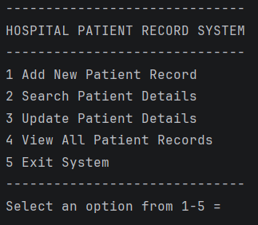
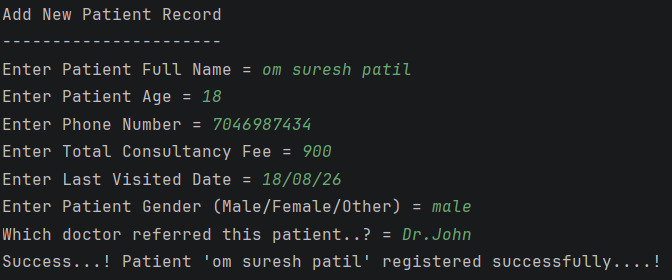
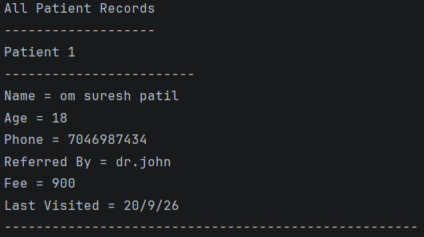
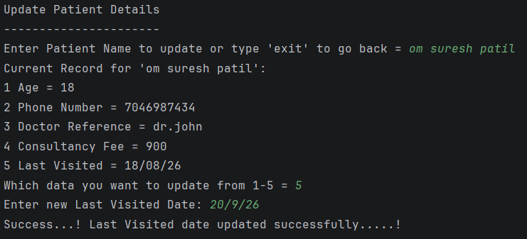

# Hospital Patient Record System

1.Overview of the project
The Hospital Patient Record System is a simple Python command-line application. 
It allows hospital staff to manage patient data easily without needing a complex database.
All data is managed using Python dictionaries while the program is running, making it fast and lightweight.

2. Features
* Add New Patient Record:- Save a patient's name, age, phone number, gender, doctor reference, fee, and last visit date.
* Search Patient Details:- Find a specific patient's full record simply by searching their name.
* Update Patient Details:- Edit a specific piece of information (like a phone number or fee) for an existing patient.
* View All Patient Records:- Print a clean, numbered list of every patient currently saved in the system.
* Safe Exit:- Prompts the user with a Yes/No confirmation before closing the application to prevent accidental exits.

3. Technologies/tools used
* Programming Language:-Python 
* Interface:-Command Line / Terminal
* Environment:-PyCharm (or any standard text editor)

4. Steps to install & run the project
* Make sure Python 3 is installed on your system. 
* Open your PyCharm IDE and create a new project.
* Create a new Python file named `main.py` and paste the project code into it.
* Open the terminal inside PyCharm (usually at the bottom of the screen).
* Run the application by typing the following command and pressing Enter:
   `pythonfinal.py`

# Instructions for testing

To verify the system works correctly, try these steps in order:

1. Test Adding: Press `1` and fill out the prompts to add a new patient. Look for the "registered successfully" message.
2. Test Searching: Press `2` and type the exact name you just entered to ensure their details print correctly.
3. Test Updating: Press `3`, search for the patient, and choose an option (like `1` for Age) to change their data.
4. Test Viewing: Press `4` to verify the patient appears in the overall list with your newly updated age.
5. Test Error Handling: Press `2` and search for a fake name. The system should show an error message instead of crashing.
6. Test Exiting: Press `5` and type `y` to safely close the program.

# Screenshots

*Add your PyCharm terminal screenshots here after running the project.*

* Screenshot 1: [Main Menu & Adding a Patient] , 
* Screenshot 2: [Viewing all records]
* Screenshot 3: [Screenshot of Successful Update Operation]